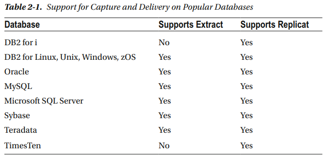
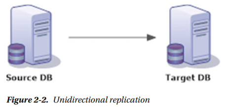
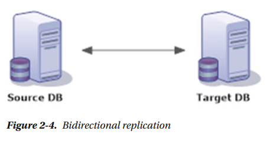
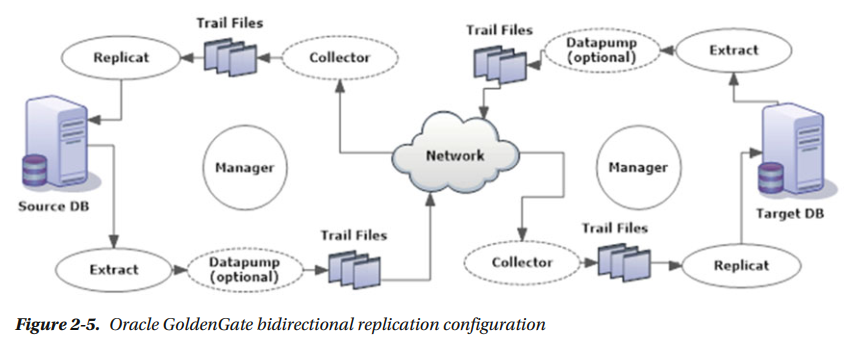

## 第二章 架构

​	在前一章中，你了解了数据复制和一些适用于你的业务的流行的复制解决方案。你还了解了Oracle GoldenGate为你的复制需求提供了什么。在本章中，我们将讨论Oracle GoldenGate架构。Oracle GoldenGate有一个模块化的体系结构，每个组件都集成在一起相互协作。

​	图2-1显示了Oracle GoldenGate的基础架构。抓取进程从数据库事务日志中捕获数据库更改，并将其写入源跟踪文件中。这些源跟踪文件由数据泵泵送（或传递）到目标系统，目标系统的动态收集器进程将它们作为远程跟踪文件写入磁盘。Replicat读取这些远程跟踪文件并将数据库更改写入目标系统。

图2-1 Oracle GoldenGate基础架构

​	源和目标都有一个manager控制进程。manager进程管理GoldenGate的每个其他组件。

​	Oracle GoldenGate由以下组件组成：

​	• Extract （抽取进程）
​	• Data pump （数据泵）
​	• Replicat （复制进程）
​	• Trails （追踪文件）
​	• Collector （收集器）
​	• Manager （管理器）
​	• Checkpoints  （检查点）

#### 组件概述

​	让我们详细讨论上一节中列出的Oracle GoldenGate的每个主要组件。了解这些组件的工作原理将帮助你根据特定的复制需求定制Oracle GoldenGate，并将帮助你有效地排除安装过程中遇到的任何错误。

##### 	抓取

​	抓取是一个捕获进程，它捕获在源模式上执行的插入、更新或删除。还可以配置一个抓取进程来捕获源DB上执行的DDL更改，并在TCP/IP网络上以路由的trail(或trail文件)的形式跨目标DB发送这些更改。抓取进程从数据库事务日志捕获这些更改，并且只捕获已提交的更改并将其写入跟踪文件。

​	主要有三种类型的抓取。

​	 • 本地抓取：这是从数据库事务日志捕获更改并将更改写入本地跟踪文件的抓取进程。

​	 • 数据泵：这是一个抓取进程，读取从本地抓取生成的本地跟踪文件，并将它们发送到目标服务器。强烈建议在你的GoldenGate配置中配置一个数据泵。下一节将讨论拥有数据泵的优点。

​	 • 初始导入抓取：这种类型的抓取进程配置为从源到目标系统的数据的初始导入。这种抓取并没有配置为从数据库事务日志捕获更改，而是捕获源表中的所有现有数据并将其直接加载到目标表中。

​	可以将抓取进程配置为将捕获更改作为单个进程来捕获所有表，也可以将其划分为多个抓取进程，每个抓取进程捕获一组表的更改。还可以配置一个抓取进程，使用通配符在一个抓取中捕获整个模式中所有表的更改。GoldenGate还提供了许多方法，可以在将数据路由到目标表加载之前过滤和转换数据。源表和目标表在设置复制时不需要具有相同的表结构。你可以将列的子集从源表复制到具有不同名称的目标表。

##### 	数据泵

​	数据泵类似于GoldenGate抓取进程。这些是从源跟踪中读取被本地抓取写入并通过TCP/IP网络将其泵送到目标的辅助抓取进程。有数据泵不是绝对必要的，但强烈建议。如果没有配置数据泵，则必须配置抓取以将跟踪发送到目标系统。以下是拥有数据泵的一些优点：

​	 • 防止丢失到目标系统的连接：假设你的目标系统宕机或存在网络连接问题。在这种情况下，没有数据泵将意味着抓取进程直接尝试将跟踪发送到无法到达的目标主机。这种情况下的抓取进程将异常终止，因为它不再能够与目标主机通信和发送跟踪。在网络连接或失败的目标系统恢复之前，不会发生任何捕获。为了减少源对目标系统连接的依赖，Oracle建议在GoldenGate设置中使用数据泵。

​	现在假设你有从源跟踪读取数据的泵，并通过TCP/IP网络将跟踪泵送到目标。如果与目标系统存在任何连接问题，数据泵将异常终止（停止工作），因为它将无法与目标系统通信。但是你仍然可以在源上运行抓取，并在源系统以源跟踪的形式捕获和写入更改。因此，数据泵还通过让抓取捕获更改并将其存储在磁盘上，直到数据泵处理这些更改，从而简化了存储设施。

​	 • 筛选和转换：在筛选和转换数据时，最好使用数据泵，因为它可以大大减少通过网络发送的不必要的数据，然后在目标系统上进行筛选。

​	 • 一对多复制：如果有多个目标，可以为每个目标配置单独的数据泵。当一个目标宕机时，只有相应的数据泵受到影响，其他目标系统继续接收数据。

​	 • 多对一复制：在从多个源合并到一个目标的数据配置中，数据泵允许你在源数据库本身存储抓取的跟踪，并且每次向目标发送一条跟踪。这种在多个源和目标之间转移存储负载的方法避免了目标系统对存储这些跟踪的巨大空间需求。

##### 复制

​	抓取进程捕获源系统上的更改，并将其写入本地跟踪文件。然后通过TCP/IP网络将这些跟踪文件发送到目标系统。复制是在目标系统上配置的投递进程，用于读取跟踪并将更改应用于目标系统。更改在数据库中应用的顺序与在源系统上提交的顺序相同。根据捕获更改的方式和内容，有两种类型的抓取。

​	 • 初始导入复制：初始导入复制是配置从源表初始化加载目标表的特殊复制。这些复制在初始加载期间只使用一次，一旦它们的工作完成，就可以删除它们。

​	 • 用于同步更改的复制：这些复制配置为从远程跟踪读取更改，并通过重现捕获的DML或DDL将这些更改应用到目标数据库。这些是你的GoldenGate配置的典型的投递进程，该配置将读取跟踪文件中捕获的数据库更改，并将其持续应用于目标数据库。

​	与抓取一样，复制也可以配置为单个进程，用于为整个模式投递更改，或者可以分割为多个进程，用于为每组源表投递更改。在将更改写入目标系统之前，还可以在复制进程中应用数据筛选和转换。

##### 跟踪

​	抓取进程捕获并将提交的事务按顺序写入名为跟踪的文件中。然后通过网络发送这些跟踪，这些跟踪在被复制读取之前写到远程机器上。

​	有两种类型的跟踪。

​	 • 源跟踪：抓取进程在本地暂存区域上写入的跟踪称为源跟踪或本地跟踪。

​	 • 远程跟踪：源跟踪由一个称为收集器的后台进程在目标系统上接收，并写入一个称为远程跟踪的类似跟踪。这些远程跟踪将由复制读取，并将更改写入目标数据库。

##### 收集器

​	收集器是一个进程，它在目标系统的后台运行，接收来自抓取的跟踪，并将它们从本地写到远程跟踪中，供复制处理。如果你使用动态端口配置，当从抓取中识别到管理器的连接请求时，收集器将扫描可用端口并将此端口信息发送给管理器，以便与抓取进程建立连接。收集器进程是一个后台进程，你不需要在GoldenGate设置中配置它。

##### 管理器

​	管理器是运行和控制所有其他Oracle GoldenGate进程和组件的主进程。它包含在特定Oracle GoldenGate实例上配置的进程的控制信息。要运行抓取或复制，管理器也应该运行。GoldenGate 管理器有以下主要功能：

​	 • 维护用于在网络上通信的端口号

​	 • 启动和停止抓取和复制

​	 • 为进程生成报告

​	 • 包含诸如“清除旧追踪”之类的控制参数

​	 • 管理跟踪文件

##### 检查点

​	检查点是GoldenGate跟踪它复制的事务的方式。GoldenGate抓取为它们在源数据库和跟踪中的位置创建检查点。因为抓取只捕获提交的事务，所以它跟踪所有打开的事务。一旦提交了事务，抓取就会回顾最旧的已打开的事务位置。此信息由磁盘上的抓取以检查点文件的形式写入。

​	另一方面，复制为它在跟踪中的位置创建检查点。此信息更有效地存储在目标数据库中创建的检查点表中。GoldenGate还以检查点文件的形式将这些信息存储在磁盘上。

​	检查点有助于数据库恢复并确保数据一致性。它保证一个事务只应用一次，即使复制在失败后重新启动。

#### 支持非oracle数据库

​	Oracle GoldenGate支持在大多数流行的数据库上的捕获和投递，如表2-1所示。但是，你不能在DB2 for i和TimesTen数据库上安装Oracle GoldenGate作为源。你仍然可以选择从其他受支持的数据库发送网络订阅，并在DB2 for i或TimesTen数据库应用事务。

#### 支持的拓扑

​	GoldenGate灵活且解耦的体系结构允许它支持各种各样的复制拓扑。以下是一些最常见的支持复制拓扑：

​	• 单向复制
​	• 双向复制
​	• 一对多复制
​	• 多对一复制
​	• 点对点复制

​	我们将讨论这些拓扑以及适合复制拓扑的场景示例。

##### 单向复制

​	源和目标之间的单向复制是最简单的复制拓扑。源上的任何数据库更改都会复制到目标上。在这种架构中，目标是只读的，更改只在源数据库中进行。

​	这种类型的复制拓扑最适合用于查询分流和报告目的。图2-2显示了源数据库和目标数据库之间单向复制的简单视图。

##### 何时使用单向复制？

​	以下是需要在两个数据库系统之间实现简单单向复制的一些业务场景。

​	• 维护一个热备份数据库，以便进行故障转移

​	• 用于在备用数据库上分流查询

​	• 用于零宕机数据库升级或迁移

​	图2-3显示了Oracle GoldenGate在单向复制配置中的组件。你需要安装两个单独的Oracle GoldenGate实例，每个数据库一个实例。源实例将捕获更改并通过网络将其发送到目标系统。目标数据库上的第二个实例将从跟踪文件中读取数据，并实时地将事务应用到目标数据库上。

#### 双向复制

​	在双向复制配置中，两个系统中的任何一个都可能发生数据库更改。这两个系统可以是源系统，也可以是目标系统。这也称为双向复制或active-active复制，因为两个系统都是活跃的，并接收事务更改。双向active-active配置应该具有相同的对象和数据。事务可以在任何一个数据库上执行，为了保持一致性，Oracle GoldenGate将事务复制到另一个数据库。图2-4显示了双向复制配置中两个系统的简单视图。

#### 双向配置的限制

​	为了数据的一致性，通常认为两个站点中的一个是主站点。当我们使用Oracle GoldenGate建立一个双向复制时，我们将在第X章详细讨论这个问题。在双向复制中不支持截断。这意味着从两个站点中的任何一个复制时你不能被允许truncate操作。但是，你可以配置你的复制以允许在一个方向上truncate，并且truncate应该总是发生在充当双向复制配置中的主数据库上。

​	图2-4显示了两个数据库之间双向复制的简单视图。

#### 何时使用双向复制?

​	以下是一些当你需要设置一个双向复制的业务场景：

​	• active-active高可用系统：在高可用配置中，如果一个数据库服务器由于软件或硬件故障而崩溃，可以重新启动应用程序以指向另一个数据库，而不必等待崩溃的数据库被修复。应用程序用户可以使用其中一个数据库来进行业务处理。在双向复制配置中，使用Oracle GoldenGate可以有效地实现这种配置。

​	• 负载共享：此配置用于两个数据库之间的负载共享。这将整个数据库系统性能提升到更高的级别。要在不更改应用程序和数据库配置的情况下允许负载共享，参与负载共享的两个数据库应该是相同的。这可以通过使用Oracle GoldenGate双向复制来有效地实现。

​	• 容灾：还可以使用双向复制配置进行容灾。当一个数据库宕机时，另一个数据库继续支持应用程序。一旦失败的数据库返回，它将被同步并与其他数据库保持一致。

​	• 零停机升级：可以使用双向复制配置进行数据库升级，而不涉及零停机。可以在现有数据库和新数据库之间建立双向复制。如果升级后的数据库不能正常工作，你可以切换回Oracle GoldenGate保持同步的旧数据库。

​	图2-5显示了双向复制配置中Oracle GoldenGate组件之间的交互。

